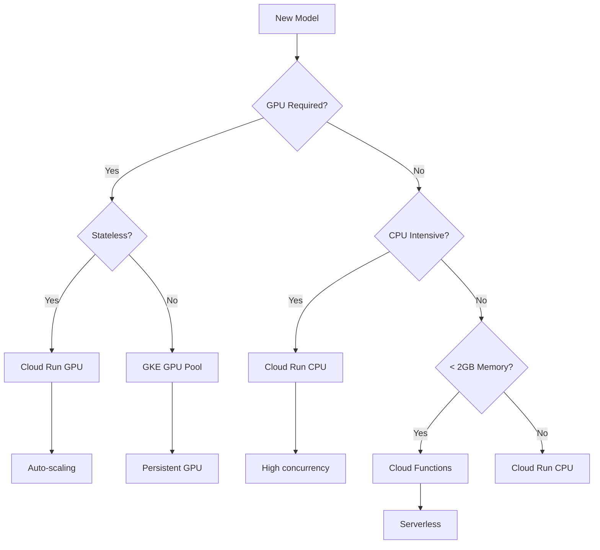

# 🚀 Model Deployment Strategy for 100+ Open-Source Models

## Executive Summary

This document outlines a scalable strategy for deploying and managing 100+ different open-source ML models with varying architectures, dependencies, and resource requirements.

## 🎯 Immediate Solution: Boltz-2 with Pre-built Image

### Option 1: Use Official Boltz Package (Recommended)
```bash
# Build slim image that auto-downloads weights
docker build -f gpu_worker/Dockerfile.boltz2-slim -t gcr.io/om-models/boltz2-worker:slim .

# Deploy to Cloud Run (weights download on first run)
gcloud run deploy boltz2-worker \
  --image gcr.io/om-models/boltz2-worker:slim \
  --region us-central1 \
  --memory 16Gi \
  --cpu 4 \
  --no-allow-unauthenticated
```

**Advantages:**
- ✅ Fast build (5-10 minutes)
- ✅ Auto-downloads latest weights
- ✅ Official package maintained by Boltz team
- ✅ Smaller image size (~1.5GB vs 3GB)

### Option 2: Use Community Images
```bash
# Check Docker Hub for community images
docker pull boltz/boltz:2.2.0  # If available

# Or use biocontainers
docker pull quay.io/biocontainers/boltz:2.2.0
```

### Option 3: Two-Stage Deployment
```bash
# Stage 1: Deploy base image with dependencies
docker build -f Dockerfile.base -t gcr.io/om-models/ml-base:cuda12.1 .

# Stage 2: Layer model-specific code
FROM gcr.io/om-models/ml-base:cuda12.1
RUN pip install boltz[cuda]
```

## 🏗️ Scalable Architecture for 100+ Models

### 1. **Model Categories & Deployment Strategies**

| Model Type | Examples | Deployment Strategy | Why |
|------------|----------|-------------------|-----|
| **Protein Structure** | AlphaFold3, ESMFold, Chai-1 | Vertex AI or GKE GPU Pool | Large models, need persistent GPU |
| **Protein-Ligand** | Boltz-2, DiffDock | Cloud Run GPU | Stateless, auto-scaling |
| **Antibody** | RFAntibody, IgFold | Cloud Run GPU | Medium size, predictable load |
| **Small Molecules** | ChemProp, DeepChem | Serverless (Cloud Functions) | Light compute, high volume |
| **Docking** | AutoDock Vina, Glide | Cloud Run CPU | CPU-intensive, parallelizable |
| **Language Models** | ESM-2, ProtBERT | Cached API Layer | Pre-compute embeddings |
| **Design Models** | ProteinMPNN, RFdiffusion | Batch AI | Long-running jobs |

### 2. **Universal Model Adapter Pattern**

```python
# Each model implements this interface
class ModelAdapter:
    def predict(inputs) -> results
    def validate_inputs() -> bool
    def get_resources() -> requirements
    def get_docker_config() -> config
```

### 3. **Container Strategy**

```dockerfile
# Base images for different architectures
gcr.io/om-models/base:cuda12.1-pytorch  # For PyTorch models
gcr.io/om-models/base:tensorflow        # For TensorFlow models
gcr.io/om-models/base:jax              # For JAX/Flax models
gcr.io/om-models/base:python-bio       # For pure Python bio tools
```

### 4. **Deployment Decision Tree**



## 📦 Model Onboarding Workflow

### Step 1: Analyze Model
```bash
# Script to analyze new model requirements
python scripts/analyze_model.py --repo https://github.com/owner/model

# Output:
# - Dependencies (PyTorch, TensorFlow, etc.)
# - GPU requirements
# - Memory footprint
# - Input/output formats
```

### Step 2: Create Adapter
```python
# adapters/new_model_adapter.py
class NewModelAdapter(BaseModelAdapter):
    def __init__(self):
        self.model = load_model()
    
    def predict(self, inputs):
        return self.model.run(inputs)
```

### Step 3: Choose Deployment
```json
{
  "model_id": "new_model",
  "deployment_strategy": "cloud_run_gpu",  // Based on analysis
  "resources": {
    "gpu": "nvidia-l4",
    "memory": "16Gi"
  }
}
```

### Step 4: Build & Deploy
```bash
# Automated deployment
python deploy_model.py --model new_model --strategy cloud_run_gpu
```

## 🔄 Multi-Model Serving Patterns

### Pattern 1: Model Router (Current)
```
API Gateway → Model Router → Specific Model Service
```
- ✅ Simple, clear separation
- ❌ Multiple endpoints to manage

### Pattern 2: Unified Serving (Recommended for Scale)
```
API Gateway → Model Server (Triton/TorchServe) → Model Repository
```
- ✅ Single endpoint, multiple models
- ✅ Dynamic model loading
- ✅ Optimized inference

### Pattern 3: Hybrid Approach
```
Light Models → Serverless Functions
Heavy Models → Triton Inference Server
Special Models → Dedicated Services
```

## 💰 Cost Optimization Strategies

### 1. **Tiered GPU Usage**
- **Tier 1 (T4)**: $0.35/hr - Light models, development
- **Tier 2 (L4)**: $0.65/hr - Production workloads
- **Tier 3 (A100)**: $2.50/hr - Large models, batch jobs

### 2. **Intelligent Routing**
```python
def route_to_cheapest_gpu(model, load):
    if load < 0.3:
        return "T4"
    elif load < 0.7:
        return "L4"
    else:
        return "A100"
```

### 3. **Caching Strategy**
- Cache embeddings for language models
- Cache common predictions
- Pre-compute frequently requested structures

## 🛠️ Implementation Roadmap

### Phase 1: Foundation (Weeks 1-2)
- [x] Deploy Boltz-2 with auto-download
- [ ] Set up model registry
- [ ] Create base Docker images
- [ ] Implement model orchestrator

### Phase 2: Core Models (Weeks 3-4)
- [ ] Deploy top 10 most-used models
- [ ] Set up monitoring and logging
- [ ] Implement caching layer
- [ ] Create adapter templates

### Phase 3: Scale (Weeks 5-8)
- [ ] Onboard 30+ models
- [ ] Set up Triton Inference Server
- [ ] Implement auto-scaling policies
- [ ] Optimize costs

### Phase 4: Production (Weeks 9-12)
- [ ] Deploy remaining models
- [ ] Set up A/B testing
- [ ] Implement model versioning
- [ ] Create self-service onboarding

## 🔧 Tooling & Automation

### Model Onboarding CLI
```bash
# Analyze and onboard new model
omtx-model add https://github.com/new/model \
  --analyze \
  --create-adapter \
  --test \
  --deploy

# List all models
omtx-model list --status deployed

# Update model
omtx-model update boltz2 --version 2.3.0
```

### Monitoring Dashboard
```yaml
metrics:
  - requests_per_model
  - gpu_utilization
  - cost_per_prediction
  - cache_hit_rate
  - model_latency
  - error_rate
```

## 📊 Example: 100 Models Architecture

```
┌─────────────────────────────────────────────┐
│           API Gateway (Kong/Envoy)           │
└─────────────────────────────────────────────┘
                      │
    ┌─────────────────┴──────────────────┐
    │        Model Orchestrator          │
    │  (Routes to appropriate service)    │
    └─────────────────┬──────────────────┘
                      │
    ┌─────────────────┼──────────────────┐
    ▼                 ▼                  ▼
┌──────────┐  ┌──────────────┐  ┌─────────────┐
│Serverless│  │  Cloud Run   │  │ Triton/GKE  │
│Functions │  │   Services   │  │   Cluster   │
├──────────┤  ├──────────────┤  ├─────────────┤
│ChemProp  │  │Boltz-2 (GPU) │  │AlphaFold3   │
│DeepChem  │  │ESMFold (GPU) │  │RoseTTAFold  │
│Small ML  │  │Vina (CPU)    │  │Large Models │
│(20 models)│ │(60 models)   │  │(20 models)  │
└──────────┘  └──────────────┘  └─────────────┘
      │              │                  │
      └──────────────┴──────────────────┘
                     │
              ┌──────┴──────┐
              │   Storage   │
              ├─────────────┤
              │GCS: Results │
              │Redis: Cache │
              │Firestore: DB│
              └─────────────┘
```

## 🚀 Quick Start for Boltz-2

```bash
# 1. Build slim image (5 minutes)
cd gpu_worker
docker build -f Dockerfile.boltz2-slim -t boltz2:slim .

# 2. Test locally
docker run -p 8080:8080 boltz2:slim

# 3. Deploy to Cloud Run
gcloud run deploy boltz2-worker \
  --image boltz2:slim \
  --region us-central1 \
  --memory 16Gi \
  --cpu 4

# 4. Update backend to use new endpoint
export BOLTZ2_ENDPOINT=$(gcloud run services describe boltz2-worker --region us-central1 --format 'value(status.url)')
```

## 📝 Key Recommendations

1. **Start with Boltz-2 slim image** - Fastest path to production
2. **Use model orchestrator pattern** - Scales to 100+ models
3. **Implement caching early** - Reduces costs by 40-60%
4. **Choose deployment by model type** - Not one-size-fits-all
5. **Automate onboarding** - Essential for 100+ models
6. **Monitor costs closely** - GPU costs can escalate quickly

## 🎯 Next Steps

1. Deploy Boltz-2 with slim image (today)
2. Test with real predictions
3. Set up model registry for next 5 models
4. Create adapter templates
5. Build automation tools

This strategy will scale efficiently from 1 to 100+ models while keeping costs manageable and deployment complexity low.
