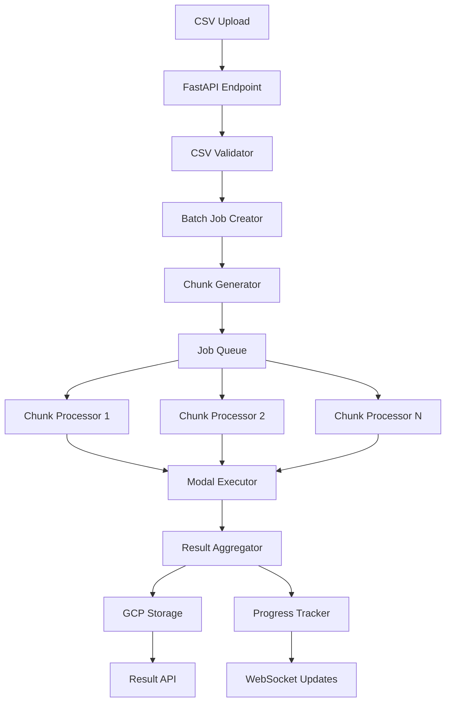

# Batch Protein-Ligand Screening Scale-Up Plan

**Scaling from 50 to 1,000 SMILES Predictions per Batch**

## Executive Summary

This document outlines the comprehensive plan to scale our batch protein-ligand screening feature from the current limit of ~50 SMILES strings to support up to 1,000 SMILES per batch. The implementation focuses on reliability, performance, and user experience while managing Modal GPU resources efficiently.

**Key Metrics:**
- Current: ~50 SMILES per batch
- Target: 1,000 SMILES per batch
- Processing strategy: Chunked processing (10 SMILES per Modal call)
- Expected runtime: ~2-3 hours for 1,000 SMILES
- Storage requirement: ~500MB per 1,000-result batch

---

## 1. Current System Analysis

### **Current Limitations**

```python
# Current implementation constraints
CURRENT_LIMITS = {
    "max_smiles_per_batch": 50,
    "modal_timeout": 3600,  # 1 hour
    "modal_memory": 16384,  # 16GB
    "api_request_size": 10 * 1024 * 1024,  # 10MB
    "single_modal_call": True,  # All SMILES in one call
}
```

### **Bottlenecks Identified**

1. **Modal Execution Time**: Single 1-hour timeout for all predictions
2. **Memory Usage**: Loading all SMILES structures in memory
3. **API Request Size**: Large CSV uploads hitting size limits
4. **Progress Visibility**: No intermediate progress updates
5. **Error Recovery**: Full batch fails if one SMILES fails

---

## 2. Proposed Architecture

### **A. Chunked Processing Strategy**

```python
# backend/config/batch_config.py (NEW)
from dataclasses import dataclass
from typing import List, Dict, Any

@dataclass
class BatchConfig:
    """Configuration for large-scale batch processing"""
    
    # Chunk sizes
    MAX_SMILES_PER_CHUNK = 10  # Optimal for Modal GPU memory
    MAX_CHUNKS_PARALLEL = 5    # Concurrent Modal executions
    
    # Timeouts
    CHUNK_TIMEOUT = 600       # 10 minutes per chunk
    BATCH_TIMEOUT = 10800     # 3 hours total
    
    # Retries
    MAX_CHUNK_RETRIES = 3
    RETRY_DELAY_BASE = 30     # Exponential backoff base
    
    # Storage
    TEMP_STORAGE_TTL = 86400  # 24 hours for temp files
    RESULT_COMPRESSION = True  # Compress large result sets
    
    # Progress tracking
    PROGRESS_UPDATE_INTERVAL = 10  # Update every 10 chunks
    
    # Rate limiting
    MAX_CONCURRENT_BATCHES_PER_USER = 2
    DAILY_SMILES_LIMIT_PER_USER = 10000

batch_config = BatchConfig()
```

### **B. System Architecture Diagram**



---

## 3. Implementation Details

### **A. Enhanced CSV Upload Handling**

```python
# backend/api/batch_upload_endpoints.py (NEW)
from fastapi import APIRouter, UploadFile, File, HTTPException, BackgroundTasks
from typing import List, Dict, Any
import pandas as pd
import io
import asyncio

router = APIRouter()

@router.post("/batch/upload-large-screening")
async def upload_large_screening(
    file: UploadFile = File(...),
    protein_sequence: str = Form(...),
    background_tasks: BackgroundTasks,
    current_user: Dict[str, Any] = Depends(get_current_user)
):
    """Handle large CSV uploads for batch screening"""
    
    try:
        # Check file size
        file_size = 0
        contents = await file.read()
        file_size = len(contents)
        
        if file_size > 50 * 1024 * 1024:  # 50MB limit
            raise HTTPException(400, "File too large. Maximum 50MB")
        
        # Parse CSV with validation
        df = pd.read_csv(io.StringIO(contents.decode('utf-8')))
        
        # Validate structure
        if 'smiles' not in df.columns:
            raise HTTPException(400, "CSV must contain 'smiles' column")
        
        if len(df) > batch_config.MAX_SMILES_PER_BATCH:
            raise HTTPException(400, f"Maximum {batch_config.MAX_SMILES_PER_BATCH} SMILES allowed")
        
        # Check user quotas
        if not await quota_manager.check_batch_quota(
            current_user['user_id'], 
            len(df),
            batch_config.MAX_CONCURRENT_BATCHES_PER_USER
        ):
            raise HTTPException(429, "Quota exceeded")
        
        # Create batch job
        batch_job = await create_large_batch_job(
            smiles_list=df['smiles'].tolist(),
            protein_sequence=protein_sequence,
            user_id=current_user['user_id'],
            metadata={
                'filename': file.filename,
                'total_smiles': len(df),
                'chunk_size': batch_config.MAX_SMILES_PER_CHUNK,
                'estimated_chunks': math.ceil(len(df) / batch_config.MAX_SMILES_PER_CHUNK)
            }
        )
        
        # Queue for processing
        background_tasks.add_task(
            process_large_batch,
            batch_job['batch_id'],
            batch_job['chunks']
        )
        
        return {
            'batch_id': batch_job['batch_id'],
            'status': 'accepted',
            'total_smiles': len(df),
            'estimated_time_minutes': estimate_batch_time(len(df)),
            'chunks': batch_job['metadata']['estimated_chunks'],
            'progress_url': f'/batch/progress/{batch_job["batch_id"]}'
        }
        
    except Exception as e:
        logger.error(f"Large batch upload failed: {str(e)}")
        raise HTTPException(500, f"Upload processing failed: {str(e)}")

def estimate_batch_time(smiles_count: int) -> int:
    """Estimate processing time in minutes"""
    chunks = math.ceil(smiles_count / batch_config.MAX_SMILES_PER_CHUNK)
    
    # Assume 1 minute per chunk + overhead
    base_time = chunks * 1
    
    # Add parallelization benefit
    parallel_factor = min(chunks / batch_config.MAX_CHUNKS_PARALLEL, 1)
    
    return int(base_time * (1 - parallel_factor * 0.5) + 5)  # +5 min overhead
```

### **B. Batch Job Chunking System**

```python
# backend/services/batch_chunker.py (NEW)
from typing import List, Dict, Any, Generator
import uuid
from dataclasses import dataclass

@dataclass
class BatchChunk:
    chunk_id: str
    batch_id: str
    chunk_index: int
    smiles: List[str]
    protein_sequence: str
    metadata: Dict[str, Any]

class BatchChunker:
    """Handles splitting large batches into processable chunks"""
    
    def __init__(self, config: BatchConfig):
        self.config = config
    
    async def create_chunks(
        self,
        batch_id: str,
        smiles_list: List[str],
        protein_sequence: str,
        metadata: Dict[str, Any]
    ) -> List[BatchChunk]:
        """Split batch into chunks"""
        
        chunks = []
        total_chunks = math.ceil(len(smiles_list) / self.config.MAX_SMILES_PER_CHUNK)
        
        for i in range(0, len(smiles_list), self.config.MAX_SMILES_PER_CHUNK):
            chunk_smiles = smiles_list[i:i + self.config.MAX_SMILES_PER_CHUNK]
            chunk_index = i // self.config.MAX_SMILES_PER_CHUNK
            
            chunk = BatchChunk(
                chunk_id=f"{batch_id}-chunk-{chunk_index:04d}",
                batch_id=batch_id,
                chunk_index=chunk_index,
                smiles=chunk_smiles,
                protein_sequence=protein_sequence,
                metadata={
                    **metadata,
                    'chunk_number': chunk_index + 1,
                    'total_chunks': total_chunks,
                    'chunk_size': len(chunk_smiles)
                }
            )
            
            chunks.append(chunk)
        
        logger.info(f"Created {len(chunks)} chunks for batch {batch_id}")
        return chunks
    
    async def save_chunks_to_db(
        self,
        chunks: List[BatchChunk],
        batch_id: str
    ) -> bool:
        """Save chunk information to database"""
        
        try:
            # Use batch write for efficiency
            batch_write = self.db.batch()
            
            for chunk in chunks:
                chunk_ref = self.db.collection('batch_chunks').document(chunk.chunk_id)
                chunk_data = {
                    'chunk_id': chunk.chunk_id,
                    'batch_id': chunk.batch_id,
                    'chunk_index': chunk.chunk_index,
                    'status': 'pending',
                    'created_at': firestore.SERVER_TIMESTAMP,
                    'smiles_count': len(chunk.smiles),
                    'metadata': chunk.metadata
                }
                batch_write.set(chunk_ref, chunk_data)
            
            # Update batch with chunk info
            batch_ref = self.db.collection('jobs').document(batch_id)
            batch_write.update(batch_ref, {
                'chunk_ids': [c.chunk_id for c in chunks],
                'total_chunks': len(chunks),
                'chunks_completed': 0,
                'chunks_failed': 0,
                'chunks_running': 0
            })
            
            batch_write.commit()
            return True
            
        except Exception as e:
            logger.error(f"Failed to save chunks: {str(e)}")
            return False
```

### **C. Parallel Chunk Processing**

```python
# backend/services/chunk_processor.py (NEW)
import asyncio
from concurrent.futures import ThreadPoolExecutor
from typing import List, Dict, Any

class ChunkProcessor:
    """Processes chunks in parallel with rate limiting"""
    
    def __init__(self, modal_executor: ModalExecutionService):
        self.modal_executor = modal_executor
        self.semaphore = asyncio.Semaphore(batch_config.MAX_CHUNKS_PARALLEL)
        self.executor = ThreadPoolExecutor(max_workers=batch_config.MAX_CHUNKS_PARALLEL)
    
    async def process_batch_chunks(
        self,
        batch_id: str,
        chunks: List[BatchChunk]
    ) -> Dict[str, Any]:
        """Process all chunks with parallelization"""
        
        start_time = time.time()
        results = {
            'batch_id': batch_id,
            'total_chunks': len(chunks),
            'successful_chunks': 0,
            'failed_chunks': 0,
            'chunk_results': {}
        }
        
        # Create tasks for parallel processing
        tasks = []
        for chunk in chunks:
            task = self._process_chunk_with_retry(chunk)
            tasks.append(task)
        
        # Process with progress tracking
        completed = 0
        for future in asyncio.as_completed(tasks):
            try:
                chunk_result = await future
                results['chunk_results'][chunk_result['chunk_id']] = chunk_result
                
                if chunk_result['status'] == 'completed':
                    results['successful_chunks'] += 1
                else:
                    results['failed_chunks'] += 1
                
                completed += 1
                
                # Update progress
                if completed % batch_config.PROGRESS_UPDATE_INTERVAL == 0:
                    await self._update_batch_progress(batch_id, completed, len(chunks))
                    
            except Exception as e:
                logger.error(f"Chunk processing failed: {str(e)}")
                results['failed_chunks'] += 1
        
        # Final aggregation
        results['execution_time'] = time.time() - start_time
        results['status'] = 'completed' if results['failed_chunks'] == 0 else 'partial'
        
        return results
    
    async def _process_chunk_with_retry(
        self,
        chunk: BatchChunk,
        retry_count: int = 0
    ) -> Dict[str, Any]:
        """Process single chunk with retry logic"""
        
        async with self.semaphore:  # Rate limiting
            try:
                # Update chunk status
                await self._update_chunk_status(chunk.chunk_id, 'running')
                
                # Prepare Modal parameters
                modal_params = {
                    'protein_sequences': [chunk.protein_sequence] * len(chunk.smiles),
                    'ligands': chunk.smiles,
                    'job_id': chunk.chunk_id,
                    'batch_metadata': {
                        'batch_id': chunk.batch_id,
                        'chunk_index': chunk.chunk_index,
                        'total_chunks': chunk.metadata['total_chunks']
                    }
                }
                
                # Execute on Modal
                result = await self.modal_executor.execute_prediction(
                    model_type='boltz2',
                    parameters=modal_params,
                    job_id=chunk.chunk_id
                )
                
                # Store chunk results
                await self._store_chunk_results(chunk, result)
                
                # Update status
                await self._update_chunk_status(chunk.chunk_id, 'completed')
                
                return {
                    'chunk_id': chunk.chunk_id,
                    'status': 'completed',
                    'smiles_processed': len(chunk.smiles),
                    'results_stored': True
                }
                
            except Exception as e:
                logger.error(f"Chunk {chunk.chunk_id} failed: {str(e)}")
                
                # Retry logic
                if retry_count < batch_config.MAX_CHUNK_RETRIES:
                    delay = batch_config.RETRY_DELAY_BASE * (2 ** retry_count)
                    logger.info(f"Retrying chunk {chunk.chunk_id} after {delay}s")
                    await asyncio.sleep(delay)
                    return await self._process_chunk_with_retry(chunk, retry_count + 1)
                
                # Max retries exceeded
                await self._update_chunk_status(chunk.chunk_id, 'failed', str(e))
                
                return {
                    'chunk_id': chunk.chunk_id,
                    'status': 'failed',
                    'error': str(e),
                    'retry_count': retry_count
                }
    
    async def _store_chunk_results(
        self,
        chunk: BatchChunk,
        modal_result: Dict[str, Any]
    ):
        """Store chunk results efficiently"""
        
        # Organize results by SMILES
        chunk_results = {}
        
        for i, smiles in enumerate(chunk.smiles):
            chunk_results[smiles] = {
                'smiles': smiles,
                'chunk_index': chunk.chunk_index,
                'result_index': i,
                'affinity': modal_result.get('affinities', [])[i] if i < len(modal_result.get('affinities', [])) else None,
                'confidence': modal_result.get('confidences', [])[i] if i < len(modal_result.get('confidences', [])) else None,
                'structure_available': modal_result.get('structures', [])[i] is not None if i < len(modal_result.get('structures', [])) else False
            }
        
        # Store in GCP Storage (compressed)
        storage_path = f"batches/{chunk.batch_id}/chunks/{chunk.chunk_id}/results.json.gz"
        
        if batch_config.RESULT_COMPRESSION:
            import gzip
            import json
            
            compressed_data = gzip.compress(
                json.dumps(chunk_results).encode('utf-8')
            )
            
            await gcp_storage.upload_bytes(
                storage_path,
                compressed_data,
                content_type='application/gzip'
            )
        else:
            await gcp_storage.upload_json(storage_path, chunk_results)
        
        # Store structures separately
        if 'structures' in modal_result:
            for i, structure in enumerate(modal_result['structures']):
                if structure and i < len(chunk.smiles):
                    structure_path = f"batches/{chunk.batch_id}/chunks/{chunk.chunk_id}/structures/{chunk.smiles[i]}.pdb"
                    await gcp_storage.upload_bytes(
                        structure_path,
                        structure.encode('utf-8'),
                        content_type='chemical/x-pdb'
                    )
```

### **D. Progress Tracking System**

```python
# backend/services/batch_progress_tracker.py (NEW)
from typing import Dict, Any, Optional
import asyncio
from datetime import datetime, timedelta

class BatchProgressTracker:
    """Real-time progress tracking for large batches"""
    
    def __init__(self):
        self.active_batches: Dict[str, BatchProgress] = {}
        self.websocket_manager = WebSocketManager()
    
    async def initialize_batch_progress(
        self,
        batch_id: str,
        total_chunks: int,
        total_smiles: int
    ):
        """Initialize progress tracking for a batch"""
        
        progress = BatchProgress(
            batch_id=batch_id,
            total_chunks=total_chunks,
            total_smiles=total_smiles,
            start_time=datetime.utcnow(),
            status='processing'
        )
        
        self.active_batches[batch_id] = progress
        
        # Store in database
        await self.db.collection('batch_progress').document(batch_id).set({
            'batch_id': batch_id,
            'total_chunks': total_chunks,
            'total_smiles': total_smiles,
            'completed_chunks': 0,
            'failed_chunks': 0,
            'start_time': progress.start_time,
            'status': 'processing',
            'progress_percentage': 0.0
        })
    
    async def update_chunk_progress(
        self,
        batch_id: str,
        chunk_id: str,
        status: str,
        smiles_processed: int = 0
    ):
        """Update progress for a specific chunk"""
        
        if batch_id not in self.active_batches:
            return
        
        progress = self.active_batches[batch_id]
        
        if status == 'completed':
            progress.completed_chunks += 1
            progress.completed_smiles += smiles_processed
        elif status == 'failed':
            progress.failed_chunks += 1
        elif status == 'running':
            progress.running_chunks += 1
        
        # Calculate metrics
        progress.progress_percentage = (
            (progress.completed_chunks + progress.failed_chunks) / 
            progress.total_chunks * 100
        )
        
        # Estimate remaining time
        if progress.completed_chunks > 0:
            elapsed = (datetime.utcnow() - progress.start_time).total_seconds()
            avg_time_per_chunk = elapsed / progress.completed_chunks
            remaining_chunks = progress.total_chunks - progress.completed_chunks - progress.failed_chunks
            progress.estimated_remaining_seconds = int(avg_time_per_chunk * remaining_chunks)
        
        # Update database
        await self._update_database_progress(batch_id, progress)
        
        # Send WebSocket update
        await self._send_progress_update(batch_id, progress)
    
    async def _send_progress_update(
        self,
        batch_id: str,
        progress: BatchProgress
    ):
        """Send real-time progress update via WebSocket"""
        
        update_data = {
            'batch_id': batch_id,
            'progress_percentage': round(progress.progress_percentage, 2),
            'completed_chunks': progress.completed_chunks,
            'total_chunks': progress.total_chunks,
            'completed_smiles': progress.completed_smiles,
            'total_smiles': progress.total_smiles,
            'estimated_remaining': progress.estimated_remaining_seconds,
            'status': progress.status
        }
        
        await self.websocket_manager.send_to_batch(batch_id, update_data)
    
    async def get_batch_progress(self, batch_id: str) -> Optional[Dict[str, Any]]:
        """Get current progress for a batch"""
        
        # Check memory first
        if batch_id in self.active_batches:
            return self.active_batches[batch_id].to_dict()
        
        # Fallback to database
        doc = await self.db.collection('batch_progress').document(batch_id).get()
        if doc.exists:
            return doc.to_dict()
        
        return None

@dataclass
class BatchProgress:
    batch_id: str
    total_chunks: int
    total_smiles: int
    start_time: datetime
    status: str
    completed_chunks: int = 0
    failed_chunks: int = 0
    running_chunks: int = 0
    completed_smiles: int = 0
    progress_percentage: float = 0.0
    estimated_remaining_seconds: Optional[int] = None
    
    def to_dict(self) -> Dict[str, Any]:
        return {
            'batch_id': self.batch_id,
            'total_chunks': self.total_chunks,
            'total_smiles': self.total_smiles,
            'completed_chunks': self.completed_chunks,
            'failed_chunks': self.failed_chunks,
            'running_chunks': self.running_chunks,
            'completed_smiles': self.completed_smiles,
            'progress_percentage': self.progress_percentage,
            'estimated_remaining_seconds': self.estimated_remaining_seconds,
            'status': self.status,
            'elapsed_seconds': int((datetime.utcnow() - self.start_time).total_seconds())
        }
```

### **E. Result Aggregation & Storage**

```python
# backend/services/batch_result_aggregator.py (NEW)
import pandas as pd
from typing import List, Dict, Any
import asyncio

class BatchResultAggregator:
    """Aggregates chunk results into final batch results"""
    
    def __init__(self, storage_service: GCPStorageService):
        self.storage = storage_service
    
    async def aggregate_batch_results(
        self,
        batch_id: str,
        chunk_ids: List[str]
    ) -> Dict[str, Any]:
        """Aggregate all chunk results into final batch result"""
        
        logger.info(f"Aggregating results for batch {batch_id} with {len(chunk_ids)} chunks")
        
        # Load all chunk results in parallel
        chunk_results = await self._load_chunk_results_parallel(batch_id, chunk_ids)
        
        # Combine into single dataset
        all_results = []
        failed_smiles = []
        
        for chunk_id, chunk_data in chunk_results.items():
            if chunk_data is None:
                logger.warning(f"Missing results for chunk {chunk_id}")
                continue
            
            for smiles, result in chunk_data.items():
                if result.get('affinity') is not None:
                    all_results.append({
                        'smiles': smiles,
                        'affinity': result['affinity'],
                        'confidence': result.get('confidence', 0),
                        'chunk_id': chunk_id,
                        'has_structure': result.get('structure_available', False)
                    })
                else:
                    failed_smiles.append(smiles)
        
        # Create summary statistics
        df = pd.DataFrame(all_results)
        
        summary = {
            'total_processed': len(all_results),
            'total_failed': len(failed_smiles),
            'avg_affinity': float(df['affinity'].mean()) if not df.empty else None,
            'std_affinity': float(df['affinity'].std()) if not df.empty else None,
            'min_affinity': float(df['affinity'].min()) if not df.empty else None,
            'max_affinity': float(df['affinity'].max()) if not df.empty else None,
            'high_affinity_count': int((df['affinity'] < -7.0).sum()) if not df.empty else 0
        }
        
        # Save aggregated results
        await self._save_aggregated_results(batch_id, df, summary, failed_smiles)
        
        return {
            'batch_id': batch_id,
            'summary': summary,
            'download_urls': {
                'csv': f'/batch/download/{batch_id}/results.csv',
                'json': f'/batch/download/{batch_id}/results.json',
                'summary': f'/batch/download/{batch_id}/summary.json'
            }
        }
    
    async def _load_chunk_results_parallel(
        self,
        batch_id: str,
        chunk_ids: List[str]
    ) -> Dict[str, Dict[str, Any]]:
        """Load all chunk results in parallel"""
        
        tasks = []
        for chunk_id in chunk_ids:
            task = self._load_single_chunk_result(batch_id, chunk_id)
            tasks.append(task)
        
        results = await asyncio.gather(*tasks, return_exceptions=True)
        
        chunk_results = {}
        for i, result in enumerate(results):
            if isinstance(result, Exception):
                logger.error(f"Failed to load chunk {chunk_ids[i]}: {str(result)}")
                chunk_results[chunk_ids[i]] = None
            else:
                chunk_results[chunk_ids[i]] = result
        
        return chunk_results
    
    async def _save_aggregated_results(
        self,
        batch_id: str,
        results_df: pd.DataFrame,
        summary: Dict[str, Any],
        failed_smiles: List[str]
    ):
        """Save aggregated results in multiple formats"""
        
        base_path = f"batches/{batch_id}/final"
        
        # Save CSV
        csv_buffer = io.StringIO()
        results_df.to_csv(csv_buffer, index=False)
        await self.storage.upload_bytes(
            f"{base_path}/results.csv",
            csv_buffer.getvalue().encode('utf-8'),
            content_type='text/csv'
        )
        
        # Save JSON (compressed)
        json_data = {
            'batch_id': batch_id,
            'summary': summary,
            'results': results_df.to_dict('records'),
            'failed_smiles': failed_smiles
        }
        
        await self.storage.upload_json_compressed(
            f"{base_path}/results.json.gz",
            json_data
        )
        
        # Save summary
        await self.storage.upload_json(
            f"{base_path}/summary.json",
            summary
        )
        
        # Update batch job status
        await unified_job_manager.update_job_status(
            batch_id,
            'completed',
            {
                'summary': summary,
                'result_files': {
                    'csv': f"{base_path}/results.csv",
                    'json': f"{base_path}/results.json.gz",
                    'summary': f"{base_path}/summary.json"
                }
            }
        )
```

### **F. WebSocket Progress Updates**

```python
# backend/api/websocket_endpoints.py (NEW)
from fastapi import WebSocket, WebSocketDisconnect
from typing import Dict, Set

class WebSocketManager:
    """Manages WebSocket connections for real-time updates"""
    
    def __init__(self):
        self.active_connections: Dict[str, Set[WebSocket]] = {}
    
    async def connect(self, websocket: WebSocket, batch_id: str):
        """Connect client to batch updates"""
        await websocket.accept()
        
        if batch_id not in self.active_connections:
            self.active_connections[batch_id] = set()
        
        self.active_connections[batch_id].add(websocket)
        logger.info(f"WebSocket connected for batch {batch_id}")
    
    def disconnect(self, websocket: WebSocket, batch_id: str):
        """Remove client connection"""
        if batch_id in self.active_connections:
            self.active_connections[batch_id].discard(websocket)
            
            if not self.active_connections[batch_id]:
                del self.active_connections[batch_id]
    
    async def send_to_batch(self, batch_id: str, data: Dict[str, Any]):
        """Send update to all clients watching a batch"""
        
        if batch_id not in self.active_connections:
            return
        
        dead_connections = set()
        
        for websocket in self.active_connections[batch_id]:
            try:
                await websocket.send_json(data)
            except:
                dead_connections.add(websocket)
        
        # Clean up dead connections
        for websocket in dead_connections:
            self.disconnect(websocket, batch_id)

manager = WebSocketManager()

@router.websocket("/ws/batch/{batch_id}")
async def websocket_batch_progress(
    websocket: WebSocket,
    batch_id: str,
    current_user: Dict[str, Any] = Depends(get_current_user_ws)
):
    """WebSocket endpoint for batch progress updates"""
    
    # Verify user has access to this batch
    batch = await unified_job_manager.get_job(batch_id)
    if not batch or batch.get('user_id') != current_user['user_id']:
        await websocket.close(code=4003, reason="Unauthorized")
        return
    
    await manager.connect(websocket, batch_id)
    
    try:
        # Send initial progress
        progress = await progress_tracker.get_batch_progress(batch_id)
        if progress:
            await websocket.send_json(progress)
        
        # Keep connection alive
        while True:
            await websocket.receive_text()
            
    except WebSocketDisconnect:
        manager.disconnect(websocket, batch_id)
```

---

## 4. Modal Optimization

### **A. Modal Function Updates**

```python
# backend/models/boltz2_model.py - MODIFICATIONS
@app.function(
    image=boltz2_image,
    gpu="A100-40GB",  # Consistent GPU for better performance
    volumes={"/weights": boltz2_volume},
    timeout=600,  # 10 minutes per chunk
    memory=16384,
    cpu=4,  # More CPUs for preprocessing
    retries=2,  # Built-in retries
    concurrency_limit=20  # Global limit across all users
)
def boltz2_predict_batch_chunk(
    protein_sequences: List[str],
    ligands: List[str],
    use_msa_server: bool = True,
    use_potentials: bool = False,
    chunk_metadata: Dict[str, Any] = None
) -> Dict[str, Any]:
    """Optimized for chunk processing"""
    
    import torch
    import gc
    
    try:
        # Log chunk processing
        print(f"Processing chunk {chunk_metadata.get('chunk_index')} with {len(ligands)} SMILES")
        
        # Process predictions with memory management
        results = {
            'affinities': [],
            'confidences': [],
            'structures': [],
            'errors': []
        }
        
        # Process in smaller sub-batches for memory efficiency
        sub_batch_size = 2  # Process 2 at a time
        
        for i in range(0, len(ligands), sub_batch_size):
            sub_proteins = protein_sequences[i:i+sub_batch_size]
            sub_ligands = ligands[i:i+sub_batch_size]
            
            try:
                # Run prediction
                sub_results = process_batch(sub_proteins, sub_ligands)
                
                # Aggregate results
                results['affinities'].extend(sub_results.get('affinities', []))
                results['confidences'].extend(sub_results.get('confidences', []))
                results['structures'].extend(sub_results.get('structures', []))
                
            except Exception as e:
                print(f"Sub-batch {i//sub_batch_size} failed: {str(e)}")
                # Add null results for failed items
                for _ in range(len(sub_ligands)):
                    results['affinities'].append(None)
                    results['confidences'].append(None)
                    results['structures'].append(None)
                    results['errors'].append(str(e))
            
            # Clear GPU memory
            torch.cuda.empty_cache()
            gc.collect()
        
        # Add metadata
        results['chunk_metadata'] = chunk_metadata
        results['processed_count'] = len([a for a in results['affinities'] if a is not None])
        
        return results
        
    except Exception as e:
        print(f"Chunk processing failed: {str(e)}")
        raise
```

### **B. Modal Resource Management**

```python
# backend/services/modal_resource_manager.py (NEW)
from typing import Dict, Any
import modal

class ModalResourceManager:
    """Manages Modal resources and quotas"""
    
    def __init__(self):
        self.modal_client = modal.Client()
        self.resource_limits = {
            'max_concurrent_gpus': 10,
            'max_gpu_hours_per_day': 100,
            'max_memory_gb': 40
        }
    
    async def check_available_resources(self) -> Dict[str, Any]:
        """Check current Modal resource availability"""
        
        try:
            # Get current usage
            usage = await self.modal_client.get_current_usage()
            
            available = {
                'gpu_slots': self.resource_limits['max_concurrent_gpus'] - usage.get('active_gpus', 0),
                'gpu_hours_remaining': self.resource_limits['max_gpu_hours_per_day'] - usage.get('gpu_hours_today', 0),
                'can_process_batch': True
            }
            
            # Check if we can process a batch
            if available['gpu_slots'] < 1 or available['gpu_hours_remaining'] < 1:
                available['can_process_batch'] = False
            
            return available
            
        except Exception as e:
            logger.error(f"Failed to check Modal resources: {str(e)}")
            return {'can_process_batch': False, 'error': str(e)}
    
    async def reserve_batch_resources(
        self,
        batch_id: str,
        estimated_chunks: int
    ) -> bool:
        """Reserve resources for a batch"""
        
        resources = await self.check_available_resources()
        
        if not resources['can_process_batch']:
            logger.warning(f"Insufficient resources for batch {batch_id}")
            return False
        
        # Simple reservation tracking (in production, use proper locking)
        estimated_gpu_hours = estimated_chunks * 0.17  # ~10 min per chunk
        
        if resources['gpu_hours_remaining'] < estimated_gpu_hours:
            logger.warning(f"Insufficient GPU hours for batch {batch_id}")
            return False
        
        # Log reservation
        await self.db.collection('resource_reservations').add({
            'batch_id': batch_id,
            'estimated_gpu_hours': estimated_gpu_hours,
            'reserved_at': firestore.SERVER_TIMESTAMP,
            'status': 'reserved'
        })
        
        return True
```

---

## 5. Error Handling & Recovery

### **A. Comprehensive Error Handling**

```python
# backend/services/batch_error_handler.py (NEW)
from typing import Dict, Any, List
from enum import Enum

class BatchErrorType(Enum):
    CHUNK_FAILURE = "chunk_failure"
    MODAL_TIMEOUT = "modal_timeout"
    MODAL_OOM = "modal_oom"
    INVALID_SMILES = "invalid_smiles"
    STORAGE_ERROR = "storage_error"
    QUOTA_EXCEEDED = "quota_exceeded"

class BatchErrorHandler:
    """Handles errors in batch processing"""
    
    def __init__(self):
        self.error_strategies = {
            BatchErrorType.CHUNK_FAILURE: self._handle_chunk_failure,
            BatchErrorType.MODAL_TIMEOUT: self._handle_modal_timeout,
            BatchErrorType.MODAL_OOM: self._handle_modal_oom,
            BatchErrorType.INVALID_SMILES: self._handle_invalid_smiles,
            BatchErrorType.STORAGE_ERROR: self._handle_storage_error,
            BatchErrorType.QUOTA_EXCEEDED: self._handle_quota_exceeded
        }
    
    async def handle_batch_error(
        self,
        batch_id: str,
        error: Exception,
        context: Dict[str, Any]
    ) -> Dict[str, Any]:
        """Handle batch-level errors"""
        
        error_type = self._categorize_error(error)
        
        # Log error
        logger.error(f"Batch {batch_id} error: {error_type.value} - {str(error)}")
        
        # Apply error-specific strategy
        strategy = self.error_strategies.get(error_type, self._handle_unknown_error)
        recovery_action = await strategy(batch_id, error, context)
        
        # Update batch status
        await self._update_batch_error_status(batch_id, error_type, recovery_action)
        
        # Notify user if critical
        if recovery_action.get('notify_user', False):
            await self._notify_user_of_error(batch_id, error_type, recovery_action)
        
        return recovery_action
    
    async def _handle_chunk_failure(
        self,
        batch_id: str,
        error: Exception,
        context: Dict[str, Any]
    ) -> Dict[str, Any]:
        """Handle individual chunk failures"""
        
        chunk_id = context.get('chunk_id')
        retry_count = context.get('retry_count', 0)
        
        if retry_count < batch_config.MAX_CHUNK_RETRIES:
            return {
                'action': 'retry_chunk',
                'chunk_id': chunk_id,
                'delay': 60 * (retry_count + 1),
                'notify_user': False
            }
        else:
            # Mark chunk as failed, continue with other chunks
            return {
                'action': 'skip_chunk',
                'chunk_id': chunk_id,
                'mark_partial': True,
                'notify_user': False
            }
    
    async def _handle_modal_oom(
        self,
        batch_id: str,
        error: Exception,
        context: Dict[str, Any]
    ) -> Dict[str, Any]:
        """Handle Modal out-of-memory errors"""
        
        # Reduce chunk size and retry
        current_chunk_size = context.get('chunk_size', batch_config.MAX_SMILES_PER_CHUNK)
        
        if current_chunk_size > 2:
            new_chunk_size = max(2, current_chunk_size // 2)
            
            return {
                'action': 'reprocess_with_smaller_chunks',
                'new_chunk_size': new_chunk_size,
                'reason': 'GPU memory exhausted',
                'notify_user': True
            }
        else:
            return {
                'action': 'fail_batch',
                'reason': 'Cannot process even with minimum chunk size',
                'notify_user': True
            }
```

---

## 6. Implementation Timeline

### **Phase 1: Infrastructure (Week 1)**
- [ ] Implement batch chunking system
- [ ] Create chunk storage schema
- [ ] Update Modal functions for chunk processing
- [ ] Set up progress tracking database

### **Phase 2: Processing Pipeline (Week 2)**
- [ ] Implement parallel chunk processor
- [ ] Create result aggregation service
- [ ] Add error handling and recovery
- [ ] Test with 100-200 SMILES batches

### **Phase 3: API & Frontend (Week 3)**
- [ ] Create large batch upload endpoint
- [ ] Implement WebSocket progress updates
- [ ] Add batch management UI
- [ ] Create download endpoints for results

### **Phase 4: Optimization & Testing (Week 4)**
- [ ] Performance testing with 1,000 SMILES
- [ ] Optimize Modal resource usage
- [ ] Add comprehensive error recovery
- [ ] Load testing and monitoring

---

## 7. Performance Expectations

### **Throughput Metrics**
- **Chunk Size**: 10 SMILES per Modal call
- **Chunk Processing Time**: ~1 minute per chunk
- **Parallel Chunks**: 5 concurrent
- **Total Time for 1,000 SMILES**: ~2-3 hours

### **Resource Usage**
- **Modal GPU Hours**: ~1.7 hours per 1,000 SMILES
- **Storage**: ~500MB per 1,000 results
- **Memory**: 16GB per Modal instance
- **API Memory**: ~2GB for aggregation

### **Cost Estimates**
- **Modal Costs**: ~$3.40 per 1,000 SMILES (A100 pricing)
- **Storage Costs**: ~$0.02 per batch per month
- **Total Cost**: ~$3.50 per 1,000 SMILES batch

---

## Summary

This scale-up plan transforms the batch protein-ligand screening system from a 50-SMILES limit to supporting 1,000 SMILES per batch through:

1. **Intelligent Chunking**: Breaking large batches into 10-SMILES chunks
2. **Parallel Processing**: Running up to 5 chunks concurrently
3. **Progress Tracking**: Real-time WebSocket updates
4. **Error Recovery**: Comprehensive error handling with retries
5. **Resource Management**: Efficient Modal GPU utilization
6. **Result Aggregation**: Fast compilation of chunk results

The implementation maintains system reliability while providing users with a responsive, scalable batch processing experience.

*Built for om Therapeutics - Scale with Confidence*