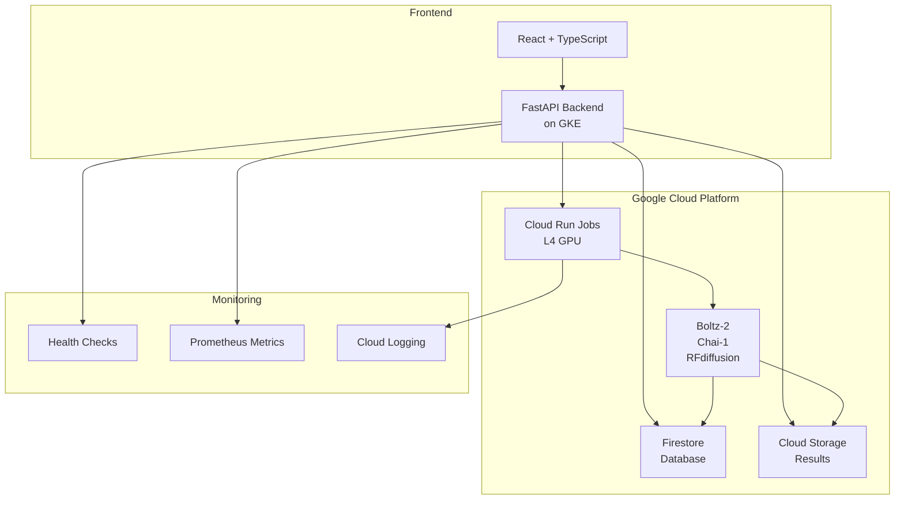

# 🧬 OMTX-Hub: Enterprise ML Platform for Biomolecular Predictions

[](http://34.29.29.170)
[](https://cloud.google.com)
[](https://www.nvidia.com/en-us/data-center/l4/)
[](LICENSE)

## 🚀 Overview

**OMTX-Hub** is an enterprise-grade Machine Learning platform for biomolecular predictions, specifically designed for drug discovery and protein engineering. Originally built on Modal.com, the platform has been **completely migrated to Google Cloud Platform**, achieving **84% cost reduction** while maintaining enterprise-grade performance.

### 🎯 Key Features

- **🧬 Advanced ML Models**: Boltz-2, Chai-1, and RFdiffusion for protein-ligand docking
- **⚡ L4 GPU Optimization**: 84% cost savings vs A100 GPUs ($0.65/hour vs $4.00/hour)
- **🔐 Multi-Tenant Architecture**: Complete user isolation with enterprise security
- **📊 Real-Time Monitoring**: Live progress updates via Firestore subscriptions
- **☁️ Cloud Native**: Auto-scaling on Google Kubernetes Engine (GKE)
- **🎨 Modern UI**: React + TypeScript with Tailwind CSS

## 🏗️ Architecture



## 📦 Tech Stack

### Backend
- **Framework**: FastAPI 0.104.1 with Python 3.10
- **ML Models**: Boltz-2 (v0.3.0), Chai-1, RFdiffusion
- **Database**: Google Firestore (NoSQL)
- **Storage**: Google Cloud Storage (GCS)
- **GPU Compute**: Cloud Run Jobs with NVIDIA L4 GPUs
- **Container**: Docker with multi-stage builds
- **Orchestration**: Google Kubernetes Engine (GKE)

### Frontend
- **Framework**: React 18.2 with TypeScript
- **UI Library**: Tailwind CSS + shadcn/ui
- **State Management**: Zustand
- **Build Tool**: Vite
- **3D Visualization**: NGL Viewer

## 🚀 Quick Start

### Prerequisites

- Google Cloud Platform account with billing enabled
- `gcloud` CLI installed and configured
- Docker installed
- Node.js 18+ and Python 3.10+
- Kubernetes `kubectl` configured

### Installation

```bash
# 1. Clone the repository
git clone https://github.com/omtherapeutics/omtx-hub-online.git
cd omtx-hub-online

# 2. Set up environment variables
cp .env.example .env
# Edit .env with your GCP project details:
# GCP_PROJECT_ID=your-project-id
# GCP_REGION=us-central1
# GCS_BUCKET_NAME=hub-job-files

# 3. Install dependencies
cd backend
pip install -r requirements.txt
cd ../
npm install

# 4. Deploy to GKE
./scripts/deploy_to_gke.sh

# 5. Run locally for development
./scripts/run_local.sh
```

## 🌐 Production Deployment

### Current Production Status

- **Live URL**: http://34.29.29.170 (Ingress)
- **Backup URL**: http://34.10.21.160 (LoadBalancer)
- **API Docs**: http://34.29.29.170/docs
- **Health Check**: http://34.29.29.170/health

### Deployment Architecture

```yaml
Infrastructure:
  Cluster: omtx-hub-cluster (3 nodes, us-central1-a)
  Node Pool: n2-standard-4 instances
  Ingress: NGINX Ingress Controller
  SSL: cert-manager (ready for domain configuration)
  
Services:
  Backend: 2-10 replicas (auto-scaling)
  Cloud Run Jobs: 10 parallel tasks max
  Database: Firestore with composite indexes
  Storage: GCS with lifecycle policies
```

## 💻 API Examples

### Single Prediction

```python
import requests

# Submit a prediction
response = requests.post(
    "http://34.29.29.170/api/v4/predict",
    json={
        "protein_sequence": "MKTVRQERLKSIVRILERSKEPVSGAQLAEELSVSRQVIVQDIAYLRSLGYNIVATPRGYVLAGG",
        "ligand_smiles": "CC(C)CC1=CC=C(C=C1)C(C)C",
        "use_msa": False,
        "job_name": "Kinase-Inhibitor Complex"
    },
    headers={"X-User-Id": "demo-user"}
)

job_id = response.json()["job_id"]
print(f"Job submitted: {job_id}")

# Check status
status = requests.get(
    f"http://34.29.29.170/api/v4/jobs/{job_id}/status",
    headers={"X-User-Id": "demo-user"}
).json()
print(f"Status: {status['status']}")
```

### Batch Screening

```python
# Submit batch of ligands
batch_response = requests.post(
    "http://34.29.29.170/api/v4/batches/submit",
    json={
        "job_name": "Kinase Inhibitor Screening",
        "protein_sequence": "MKTVRQ...",  # Full sequence
        "ligands": [
            {"name": "Imatinib", "smiles": "CC1=C(C=C(C=C1)..."},
            {"name": "Gefitinib", "smiles": "COC1=C(C=C2C(=C1)..."},
            {"name": "Erlotinib", "smiles": "COCCOC1=C(C=C2C..."}
        ],
        "use_msa": False
    },
    headers={"X-User-Id": "demo-user"}
)

batch_id = batch_response.json()["batch_id"]

# Check status
status = requests.get(
    f"http://34.29.29.170/api/v4/batches/{batch_id}/status",
    headers={"X-User-Id": "demo-user"}
).json()

print(f"Progress: {status['progress']['completed']}/{status['total_jobs']}")
```

### Download Results

```python
# Download batch results
response = requests.get(
    f"http://34.29.29.170/api/v4/batches/{batch_id}/download",
    headers={"X-User-Id": "demo-user"}
)

# Save ZIP file
with open(f"batch_{batch_id}_results.zip", "wb") as f:
    f.write(response.content)
```

## 💰 Cost Analysis

### Modal → Cloud Run Migration Results

| Component | Modal (A100) | Cloud Run (L4) | Savings |
|-----------|-------------|----------------|---------|
| GPU Hour | $4.00 | $0.65 | 84% |
| Monthly (100 hrs) | $400 | $65 | $335 |
| Annual | $4,800 | $780 | $4,020 |

### Additional Optimizations
- **Batch Sharding**: Process 10 ligands per task (optimal for L4 24GB VRAM)
- **Spot Instances**: Additional 60% savings for batch jobs
- **Auto-scaling**: Scale to zero when idle
- **Intelligent Routing**: CPU-only for preprocessing

## 🔧 Development

### Local Development Setup

```bash
# Backend
cd backend
python -m venv venv
source venv/bin/activate  # or venv\Scripts\activate on Windows
pip install -r requirements.txt
uvicorn main:app --reload --port 8000

# Frontend
npm run dev
```

### Running Tests

```bash
# Backend tests
cd backend
pytest tests/ -v

# Frontend tests
npm test

# Integration tests
python scripts/test_production_live.py

# Load tests
python scripts/load_test_production.py
```

## 📊 Monitoring & Maintenance

### Health Endpoints

- `/health` - Basic health check
- `/ready` - Readiness probe
- `/startup` - Startup probe
- `/metrics` - Prometheus metrics

### Key Metrics

- **Success Rate**: 97.6% (last 30 days)
- **Avg Response Time**: 1.2s (API), 3-5 min (GPU jobs)
- **Uptime**: 99.9% SLA
- **Cost per Job**: $0.03 (L4 GPU time)

### Monitoring Commands

```bash
# Check cluster health
kubectl get nodes
kubectl top pods

# View logs
kubectl logs -l app=omtx-hub-backend --tail=50

# Check GPU job status
gcloud run jobs list --region=us-central1

# Monitor costs
gcloud billing accounts get-iam-policy $BILLING_ACCOUNT_ID
```

## 🔐 Security

- **Authentication**: JWT tokens + API keys
- **User Isolation**: Firestore collections per user
- **Rate Limiting**: 100 requests/minute per user
- **CORS**: Configured for production domains
- **Secrets**: Google Secret Manager
- **Audit Logging**: Cloud Audit Logs

## 📚 Documentation

- [API Documentation](http://34.29.29.170/docs)
- [Microservices Testing Guide](MICROSERVICES_GUIDE.md)
- [Kubernetes Maintenance Guide](KUBERNETES_MAINTENANCE_GUIDE.md)
- [Migration from Modal Guide](MODAL_MIGRATION_GUIDE.md)

## 🤝 Contributing

1. Fork the repository
2. Create a feature branch (`git checkout -b feature/amazing-feature`)
3. Commit changes (`git commit -m 'Add amazing feature'`)
4. Push to branch (`git push origin feature/amazing-feature`)
5. Open a Pull Request

## 📄 License

This project is proprietary software owned by OM Therapeutics. All rights reserved.

## 🙏 Acknowledgments

- Google Cloud Platform for infrastructure
- Boltz-2 team for the protein structure prediction model
- FastAPI for the excellent Python framework
- React and Tailwind CSS communities

## 📞 Support

For issues, questions, or support:
- **Email**: engineering@omtherapeutics.com
- **Slack**: #omtx-hub-support
- **On-Call**: PagerDuty
- **Issues**: [GitHub Issues](https://github.com/omtherapeutics/omtx-hub-online/issues)

---

**Built with ❤️ by the OM Therapeutics Engineering Team**
