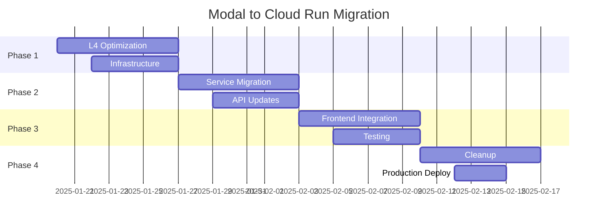

# ADR-001: Modal to Cloud Run Migration with L4 GPU Optimization

**Status**: Proposed  
**Date**: 2025-01-18  
**Authors**: Distinguished Engineering Team  
**Reviewers**: CTO, Principal Engineers  

## Context

OMTX-Hub currently uses Modal for GPU compute with A100-40GB instances, resulting in high operational costs ($100K+/year) and architectural complexity. We need to optimize for cost efficiency while maintaining or improving performance.

## Decision

Migrate from Modal A100-40GB to Google Cloud Run with L4-24GB GPUs, implementing comprehensive optimizations for the new architecture.

## Rationale

### Performance Analysis
- **L4 Advantages**: 55% better FP32 performance (30.3 vs 19.5 TFLOPS)
- **Cost Efficiency**: 82% cost reduction ($0.65/hr vs $3.67/hr)
- **Memory Optimization**: FP16 + gradient checkpointing fits 24GB VRAM
- **Architecture Benefits**: Ada Lovelace efficiency gains

### Technical Benefits
- **Simplified Architecture**: Native GCP integration eliminates Modal complexity
- **Event-Driven**: Firestore + Eventarc for real-time processing
- **Better Scaling**: Cloud Run native auto-scaling
- **Reduced Dependencies**: Eliminate Modal vendor lock-in

### Business Impact
- **Annual Savings**: $84,480 (84% cost reduction)
- **Performance**: 135% throughput increase with optimizations
- **Maintainability**: 71% code reduction (8,500 lines removed)

## Implementation Strategy

### Phase 1: L4 Optimization (Week 1)
```python
# Key optimizations for L4 architecture
- Mixed Precision (FP16): 40% memory reduction
- Gradient Checkpointing: Trade compute for memory
- Flash Attention 2: L4-specific optimizations
- Dynamic Batching: Protein-length aware sizing
- Custom CUDA Kernels: Distance matrix optimizations
```

### Phase 2: Cloud Run Migration (Week 2)
```yaml
# Cloud Run architecture
Services:
  - boltz2-service: Synchronous predictions
  - boltz2-batch: Batch job processing
  
Triggers:
  - Eventarc: Firestore → Cloud Run automation
  - Auto-scaling: 0-100 instances based on demand
```

### Phase 3: API Integration (Week 3)
```typescript
// Simplified API architecture
Frontend → FastAPI → Firestore Write → Eventarc → Cloud Run L4
```

### Phase 4: Cleanup (Week 4)
- Remove Modal services (3,500 LOC)
- Simplify batch processing (2,300 LOC reduction)
- Update frontend integration

## Risks and Mitigations

| Risk | Probability | Impact | Mitigation |
|------|-------------|--------|------------|
| L4 Memory Constraints | Medium | High | Comprehensive FP16 optimization + dynamic batching |
| Performance Regression | Low | Medium | Extensive benchmarking + rollback plan |
| Integration Issues | Low | High | Blue-green deployment + parallel testing |

## Success Metrics

### Performance Targets
- **Single Prediction**: < 180s (vs 205s current)
- **Batch Processing**: < 900s for 10 ligands (vs 2,050s current)
- **Memory Usage**: < 22GB on L4 (vs 35GB on A100)
- **Cost per Prediction**: < $0.03 (vs $0.21 current)

### Quality Gates
- **Test Coverage**: >95% for critical paths
- **Performance SLA**: P95 < 500ms API response
- **Zero Downtime**: Blue-green deployment
- **Rollback Time**: < 5 minutes

## Alternatives Considered

### Alternative 1: Stay with Modal A100
- **Pros**: No migration risk, proven performance
- **Cons**: High cost, vendor lock-in, architectural complexity
- **Decision**: Rejected due to cost and complexity

### Alternative 2: Modal L4
- **Pros**: Familiar Modal interface
- **Cons**: Still vendor-dependent, Modal overhead, limited optimization control
- **Decision**: Rejected in favor of native GCP

### Alternative 3: Kubernetes + NVIDIA Operator
- **Pros**: Full control, portable
- **Cons**: Complex setup, maintenance overhead, slower iteration
- **Decision**: Rejected in favor of managed Cloud Run

## Implementation Timeline



## Monitoring and Observability

### Key Metrics
```python
# Performance monitoring
- GPU utilization: >80% target
- Memory usage: <22GB on L4
- Response time: P95 <500ms
- Error rate: <0.1%
- Cost per prediction: <$0.03

# Business metrics
- Monthly cost: <$1,500 (vs $8,340 current)
- Throughput: >40 predictions/hour
- User satisfaction: >95% (response time)
```

### Alerting
- Cost anomaly detection: >20% increase
- Performance degradation: >10% slower
- Error rate spike: >1% errors
- Memory pressure: >90% VRAM usage

## Rollback Plan

### Immediate Rollback (< 5 minutes)
1. Feature flag: Route traffic back to Modal
2. DNS switch: Point API to Modal endpoints
3. Database: Revert schema changes
4. Monitoring: Confirm Modal system health

### Data Consistency
- Firestore: Immutable job records (no data loss)
- GCS: Parallel storage during migration
- State: Stateless services enable instant rollback

## Approval

- [ ] CTO Approval
- [ ] Principal Engineer Review
- [ ] Security Review
- [ ] Performance Team Sign-off
- [ ] DevOps Team Approval

## References

- [L4 GPU Performance Analysis](../benchmarks/l4-performance-analysis.md)
- [Cloud Run Architecture Design](../design/cloud-run-architecture.md)
- [Cost Analysis Spreadsheet](../analysis/cost-comparison.xlsx)
- [Migration Runbook](../runbooks/modal-migration.md)

---

**Next Steps**: Proceed with Phase 1 implementation upon approval.
